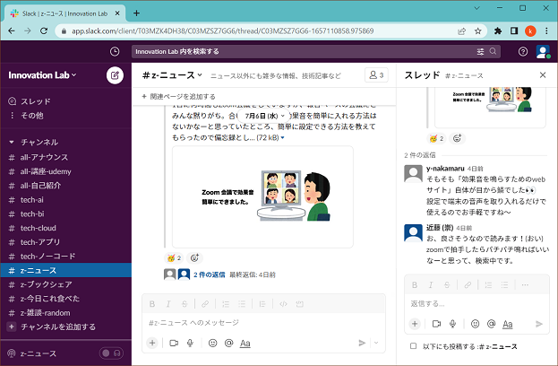
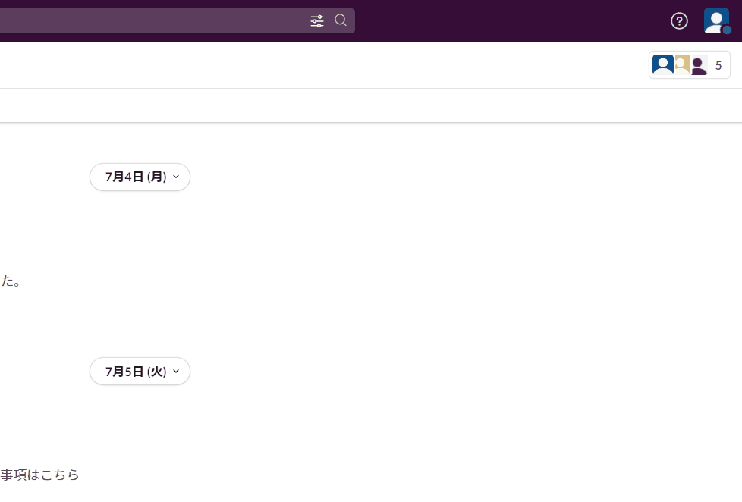
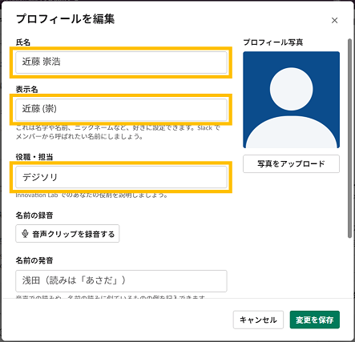
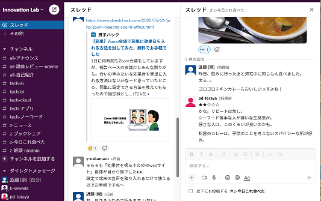
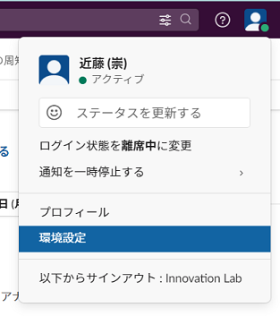
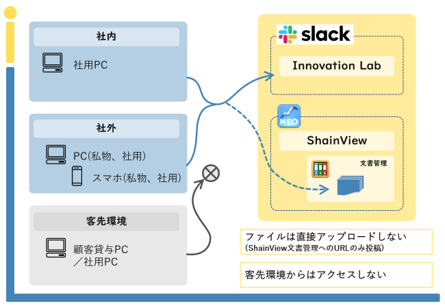
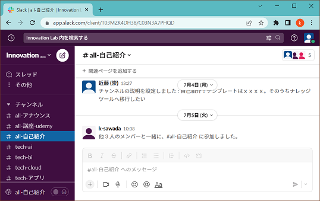
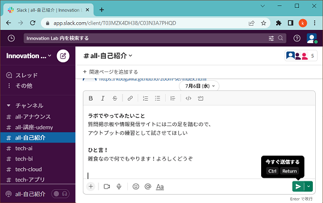
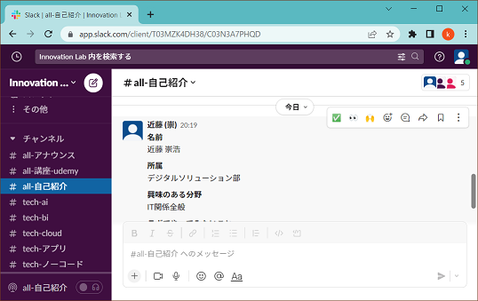

# イノベーションラボ利用ガイド

## **ご参加ありがとうございます！**
---

  ここではイノベーションラボのコミュニケーションツールとして使用する `Slack` に関して、<br>
  (1)初期設定の案内と(2)利用上の注意点、(3)実際に使ってみる といったところをガイドしていきます。

## 利用ガイド目次
---


### 目次

  * ### [画面説明](#画面説明)

  * ### [初期設定案内](#初期設定案内)

    * 概要
    * プロフィール設定 (■)
    * 環境設定
    * アプリ導入

  * ### [利用時の注意点](#利用時の注意点) (■)

    * セキュリティ関係の注意点
      * ファイルのアップロード禁止
      * 客先端末からのアクセス制限
    * その他利用上の注意点

  * ### [チャンネルについて](#チャンネルについて) (★)

  * ### [初めての投稿](#初めての投稿)

    * 自己紹介 (■)

  * ### [最後に](#最後に) (★)

### 対象読者: イノベーションラボ参加メンバー
  * ##### Slackよく知らないよ って方は全部
  * ##### Slackね、はいはい って方は ■ が必須
  * ##### ラボ期待してます って方は特に ★ を

<div style="page-break-before:always"></div>

## 画面説明
---

  SlackのWeb画面は1ページ構成で、左メニューのチャンネルリストと右のメイン画面に分かれています。

  メイン画面には選択中のチャンネル内のメンバーのメッセージが時系列表示され、<br>最右部にはメッセージへの返信をスレッド形式で表示させておくことができます。

  自分でメッセージを送る場合は、メイン画面下部にあるメッセージフィールドを使います。<br>`Ctrl + Enter` は送信ボタンとして機能しますので、入力中はお気を付けを。

  

<div style="page-break-before:always"></div>

## 初期設定案内
---

* ### 概要

  まずはプロフィールの設定をお願いします。<br>
  これがInnovation Labワークスペースでの唯一の必須設定としています。

  その他の設定は任意です。<br>
  見映えの変更を少し紹介しておきます。

* ### プロフィール設定

  * #### プロフィール編集の開き方

    

  * #### プロフィールの編集内容

    `氏名`と`表示名`を変更し、`役職・担当`欄には所属部署を入れましょう。

    対面の少ないラボ活動で、会話はしたけどSlackで見つけられない...というのを減らしたいのが目的となっています。

    * 氏名
      * **実名** でお願いします。
        * 最初はSlackアカウント作成時に入力した氏名か、メールアドレスのローカルパート(@の左側)となっています。

    * 表示名
      * 何でもOKです。
        * 入力内容は、投稿者やメンション先、ユーザーリスト上の表示に使用されます。
        * 空欄のままの場合は氏名が使われます。

    * 役職・担当
      * 所属部署を記載してください。略称で十分です。

    

  * #### プロフィール写真

    好きな画像でのアピールをお願いします。<br>
    未設定のデフォルトばかりだと、絵面が盛り上がらないのです。

    ペット、インテリア小物、釣果、お子さん、アニメなんでもどうぞ。<br>
    公序良俗だけは遵守願います(__)

    <br>
    ↑デフォルトばかりで絵面に盛り上がりが欠けている様

* ### 環境設定

  その他の設定は **任意** です。<br>
  プロフィールの近くから設定画面を開くことができます。

  <br>
  ↑環境設定リンク

  通知の頻度や時間帯、メッセージの表示形式、キーバインドなどをカスタマイズ可能となっています。

  [Slackの公式ヘルプ: プロフィールと環境設定](https://slack.com/intl/ja-jp/help/categories/360000047906) が充実していますので、一通り目を通しておくと良いかもしれません。

  * #### 複数のSlackワークスペースを使っている場合

    イノベーションラボ以外にも部課内や案件でSlackを利用していて、<br>区別がつかなくなる懸念がある場合、ワークスペースが識別できる`テーマ設定`を行うのが有用です。

    <br>
    ↑見間違えない様に変更しましょう

<div style="page-break-before:always"></div>

* ### アプリ導入

  SlackにはWeb/デスクトップ/モバイルのアプリがあり、<br>今お読みのガイドはブラウザから見られるWebアプリをベースに案内しています。

  デスクトップ用、モバイル用アプリはSlack専用に作成されているだけの良さがあるため、是非導入を検討してみてください！<br>
  インストール方法は外部サイトが詳しいのでリンク先から！

   * [Slackをモバイルアプリやデスクトップアプリから利用する](https://ascii.jp/elem/000/004/010/4010866/)

     * 基本はこのサイトで。

   * [【iOS/Android版】Slackをスマホ(&iPad)アプリで初回サインインする一連の流れ](https://businesschatmaster.com/slack/sp_initial_app_slack)

     * モバイルからのサインインはこっちにも。

## 利用時の注意点
---

  * ### セキュリティ関係の注意点

    セキュリティ観点からのお願い事項です。<br>
    Slackフリープランでの運用上、システムでの制限に限界がありますので各自での遵守をお願いしています。

    * ファイルのアップロード禁止

      画像以外のファイルアップロードは原則禁止となります...。

      メンバー間では、先にShainview文書管理へファイルを格納し、URLを連携する形で共有をお願いします。

    * 客先からのアクセス

      客先環境からは、顧客の許可の上でアクセスをお願いします><。

    

  * ### その他利用上の注意点（お願い）

    * プライベートチャンネル

      イノベーションラボは、オープンな場として開設していますので、作成するチャンネルはパブリックでお願いします！

      例えば所属部署限定の業務連絡用チャンネルは、ちょっと...ここでやらなくてもいいかな。

## チャンネルについて
---

  * #### 興味のあるチャンネルへご参加お願いします！

    参加方法は [公式ヘルプ: チャンネルに参加する](https://slack.com/intl/ja-jp/help/articles/205239967-%E3%83%81%E3%83%A3%E3%83%B3%E3%83%8D%E3%83%AB%E3%81%AB%E5%8F%82%E5%8A%A0%E3%81%99%E3%82%8B) をご参考までに。

    * 特にない...、アレ欲しい！ といった場合、是非チャンネルを自分で作成しましょう。

    * チャンネルへの参加／退出は自由です。

      少人数チャンネルへの参加時には既存メンバーにメッセージが通知されますが、退出時は特には通知が出ません。<br>
      参加／退出に気を使う必要はないです。

  * #### チャンネルの命名規則

    チャンネルは自由に作成できますが、その際は以下の規則で命名をお願いします。

    ```
    (プレフィックス)-(チャンネル分類)-(小分類)

    // 例
      z-旅行先
      z-旅行先-海外
      z-おススメ-旅行先
      tech-cloud-azure
    ```

    * プレフィックス？？

      |      |       |
      | ---- | ----- |
      | all  | メンバー全員参加の初期チャンネルと情報共有の場           |
      | tech | 最新情報共有や質問を行う技術コミュニティ                 |
      | tmp  | 期限を決めて活動する暫定チャンネル。消し時を明示してね！ |
      | wg   | テーマや目的をもって立ち上ったワーキングチーム           |
      | z    | 雑談チャンネル。なんでもいいよ！                         |

    * チャンネル分類は自由にセンス良く付けてください。
    * 小分類はなくとも構いません。
    * (注意)
      * 長期間投稿のないチャンネルはアーカイブする予定です。
        期間などの詳細は未定です。

  * #### 初期チャンネルを紹介しておきます。

    * 初めから参加しているチャンネル

      * all_アナウンス

        全体への通知用です。
        ワークスペース参加者全員が必ず参加しています。

      * all_講座-udemy

        Udemyの受講感想や、講座紹介をここで投稿してください。

      * all_自己紹介

        そもそも知らない人ばかりでコミュニケーションが活発にできるわけがありません（自分はそう）。<br>
        せめて自己紹介でお互いを知りましょう！

      * z-雑談-random

        どんな内容でも投稿OKです。

    * その他の最初に用意しているチャンネル

      各チャンネルに説明を記載しているのでご参考まで！

## 初めての投稿
---

  * ### 自己紹介

    では初投稿として、自己紹介をしてみましょう。

    1. まずフォーマット

        フォーマットを守る必要はないです。<br>
        ラボでやってみたいこと、はぜひ知りたいです！

        ```markdown
        *名前*
          ○○ ○○

        *所属*
          ○○○○部

        *興味のある分野*
          (とにかく興味のあることを)

        *ラボでやってみたいこと*
          (思いつきでOK)

        *ひと言！*
          (自由にアピールお願いします)

        *その他何でもどうぞ*
          (例文に例を並べときます)
        ```

        ### 例
        ---

          ##### **名前**

           デジソリ 太郎

          ##### **所属**

           デジタルソリューション部

          ##### **興味のある分野**

           例えば...
           ・AI
           ・Business Inteligence
           ・CX
           ・Cyber Security
           ・Cloud
           ・Data Integration
           ・Design Thinking
           ・IoT
           ・横文字わからん
           ・もっと別の粒度でOK(言語やFWとか？)

          ##### **ラボでやってみたいこと**

           例えば...
           ・質問掲示板には質問しづらいのでここで皆の知恵を借た
           ・情報発信サイトに二の足を踏んでるのでアウトプット練習の場としたい
           ・DXとか言ってるんなんなの教えて
           ・一人じゃ捗らないので、AIの学習してるんなら混ざりたい
           ・ラボでなにやるのか見てみたい
           ・↑もっとポジティブだととてもうれしい

          ##### **ひと言！**

           ここは自由に...

          ##### **その他何でもどうぞ**

           例えば...
           ・保有資格
           ・座右の銘
           ・得意なこと
           ・おススメ書籍
           ・Youtubeコレ見とけ
           ・講座なんでも
           ・このTED知っとう？
           ・サイトをご紹介

    1. 投稿先チャンネル

       自己紹介用のチャンネル `all_自己紹介` を開きます。

       

    1. メッセージフィールドで編集

       フォーマットをメッセージフィールドへ貼り付けて、内容を編集しましょう。<br>
       もちろん、自前のエディタで編集 -> メッセージフィールドへ、でもいいです。

       フォーマットには `Markdown` が含まれるので、貼付け後に `Ctrl + Shift + F` で `*名前*` が **名前**(太字) になります。

       メッセージフィールド上部には、テキスト装飾用のボタンがあるので
       こちらも有効活用しましょう。

    1. 投稿ボタンで投稿

       右下の投稿ボタン、または `Ctrl + Enter` で内容が投稿できます。

       

    1. 投稿できました

       以上、メッセージフィールドからチャンネルへメッセージを投稿する方法を
       自己紹介を使って案内しました。

       

## 最後に
---

  * ガイド内容

    イノベーションラボ参加時に使用するツールである `Slack` で、<br>ラボとして必要な設定、使用の際の注意事項、投稿の方法のガイドでした。

    `Slack`を使ったことがある人には慣れた内容でしたでしょうが、**注意事項だけは気に留めておいて**ください。<br>
    初めてという人も、グループチャット主体のLINEのようなもの、という理解でいいかと思います。

      * [Slackとは？ LINEユーザーなら3分で理解できる基礎知識](https://appllio.com/basic-knowledge-of-slack)

  * このあと

    まだ、そもそもイノラボって何するの？な状態だと思います。

    運営として期待するラボの盛り上がりは、`tech`チャンネルで技術記事紹介やメンバーのコレやってみた が投稿され、<br>業務で困ったときの質問に回答がバシバシついたり、`wg`チャンネルにはワーキングが乱立してて、Udemyの受講報告も沢山...<br>
    といった感じです。

    そのようにSlack上でのコミュニケーションが促進されるよう、<br>イノベーションラボ運営は投稿しやすい雰囲気作りを目指していきます。

    ラボの参加メンバーには、`Udemyの受講報告`に加えて、各チャンネルに合うと思った`技術記事の投稿`や<br>業務で出た`疑問の相談`、`得た知識のおすそ分け`を期待しています。

    ### 賛同いただければ幸いです。<br>よろしくお願いします！

## 以上
---

  * 2022/07/10
    * 新規作成
