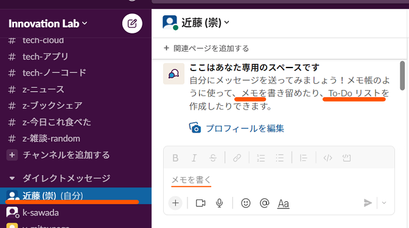
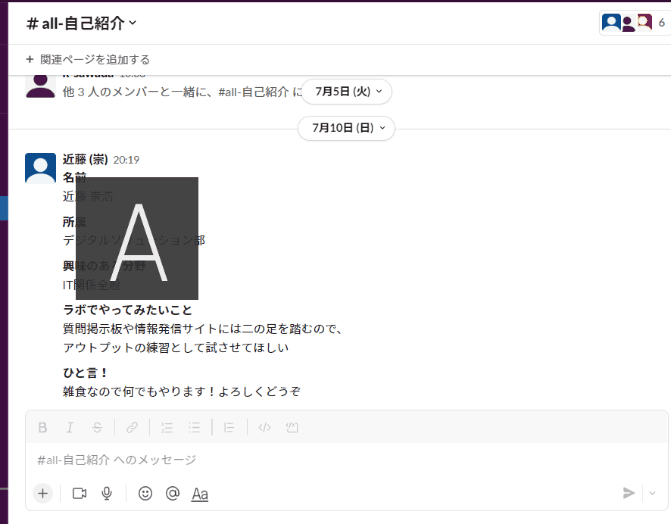

# イノベーションラボ利用ガイド: 補足情報

## これは何
---

  ガイド本編の記載から漏れた補足的情報を纏めています。<br>
  読んでもいいし、読まなくてもいい。

## 記載内容
---

  * [イノベーションラボのSlackワークスペースについて](#%E3%82%A4%E3%83%8E%E3%83%99%E3%83%BC%E3%82%B7%E3%83%A7%E3%83%B3%E3%83%A9%E3%83%9C%E3%81%AEslack%E3%83%AF%E3%83%BC%E3%82%AF%E3%82%B9%E3%83%9A%E3%83%BC%E3%82%B9%E3%81%AB%E3%81%A4%E3%81%84%E3%81%A6)

  * [複数のSlackワークスペースを使っている場合のおススメ](#%E8%A4%87%E6%95%B0%E3%81%AEslack%E3%83%AF%E3%83%BC%E3%82%AF%E3%82%B9%E3%83%9A%E3%83%BC%E3%82%B9%E3%82%92%E4%BD%BF%E3%81%A3%E3%81%A6%E3%81%84%E3%82%8B%E5%A0%B4%E5%90%88%E3%81%AE%E3%81%8A%E3%82%B9%E3%82%B9%E3%83%A1)

  * [アプリ導入](#%E3%82%A2%E3%83%97%E3%83%AA%E5%B0%8E%E5%85%A5)

  * [投稿関連](#%E6%8A%95%E7%A8%BF%E9%96%A2%E9%80%A3)


## イノベーションラボのSlackワークスペースについて
---

  * ### URL

    このURLをブックマークしとくとよいです。

    <a href="https://innovation-lab-mz3502.slack.com/" target="_blank">https://innovation-lab-mz3502.slack.com/</a>

  * ### フリープランのため、若干の制限があります

    詳細はプラン比較をどうぞ。<br>
    <a href="https://slack.com/intl/ja-jp/pricing/paid-vs-free" target="_blank">Slack公式: SLACK 有料プラン VS フリープラン</a>

    意識しておくのは2点。

    1. 参照できるメッセージは過去三か月分

        フリープランでは、過去90日間分以前のメッセージが参照できなくなります。<br>
        Slackに書き込まれるのは消えてなくなっていく`フロー情報`です。

        ※ なので`ストック情報`化の方法検討を進めていきましょう！

        ※ 2022.09のプラン改編で1万メッセージから過去90日間分に変更がありました。

    1. 追加できるインテグレーション(Slackアプリ)は10個まで

        Slackワークスペースにアプリを入れて機能追加できます。<br>
        フリープランでは**ワークスペース全体でアプリ10個まで**となっているので、有効活用していきましょう。

        ##### チャンネル名クリックで出てくるメニューから管理画面へ行けます。<br>今何が入っているか見るときにどうぞ
          

  * ### チャンネル作成は自由です

      条件は、パブリックチャンネルであること だけです。<br>
      興味のある分野のチャンネル、ちょっとやってみたいワーキングのチャンネルなどなど。

      自分で作るのは...(気が引ける😢、めんどい👹)というメンバーは、<br>
      どんなチャンネルにするか考えたうえで、`z-相談-なんでも` チャンネルで一声どうぞ。

    * #### 注意

      長期間投稿のないチャンネルはアーカイブする予定です。
      期間などの詳細は未定です。

  * ### チャンネルの命名規則

    チャンネルは自由に作成できますが、その際は以下の規則で命名をお願いします。

    ```
    (プレフィックス)-(チャンネル分類)-(小分類)

    // 例
      z-旅行先
      z-旅行先-海外
      z-おススメ-旅行先
      tech-cloud-azure
    ```

    * プレフィックス？？

      |      |       |
      | ---- | ----- |
      | all  | メンバー全員参加の初期チャンネルと情報共有の場           |
      | tech | 最新情報共有や質問を行う技術コミュニティ                 |
      | tmp  | 期限を決めて活動する暫定チャンネル。消し時を明示してね！ |
      | wg   | テーマや目的をもって立ち上ったワーキングチーム           |
      | z    | 雑談チャンネル。なんでもいいよ！                         |

    * チャンネル分類は自由にセンス良く付けてください。
    * 小分類はなくとも構いません。

## 複数のSlackワークスペースを使っている場合のおススメ
---

  * ### おススメ設定

    イノベーションラボ以外にも部課内や案件でSlackを利用していて、<br>区別がつかなくなる懸念がある場合、ワークスペースが識別できる`テーマ設定`を行うのが有用です。

    <br>
    ↑見間違えない様に変更しましょう

## アプリ導入
---

  * ### Slackには、Web/デスクトップ/モバイルのアプリがあります

    ガイドではブラウザから見られるWebアプリをベースに案内しました。

    デスクトップ用、モバイル用アプリはSlack専用に作成されているだけの良さがあるため、是非導入を検討してみてください！<br>
    インストール方法は外部サイトが詳しいのでリンク先から！

    * <a href="https://ascii.jp/elem/000/004/010/4010866/" target="_blank">Slackをモバイルアプリやデスクトップアプリから利用する</a>

      * 基本はこのサイトで。

    * <a href="https://businesschatmaster.com/slack/sp_initial_app_slack" target="_blank">【iOS/Android版】Slackをスマホ(&iPad)アプリで初回サインインする一連の流れ</a>

      * モバイルからのサインインはこっちにも。

## 投稿関連
---

  * ### 自分への投稿

    チャンネルへメッセージを投稿する間に、**テスト投稿ができます**。

    画面左部のユーザーリスト最上段の `(自分)` ユーザーは操作者自身です。<br>
    メッセージが実際にどのように表示されるかの確認や、思いついたメモ、<br>スマホ版Slackからデスクトップ版SlackへのURL共有など色々と利用できます。

    

  * ### リアクション

    投稿されたメッセージにリアクションしましょう。

    Slackでリアクションといえばフツーは絵文字です。<br>
    他の人のメッセージにテキトーにバシバシつけてお気持ち表明しましょう。

    

    自分のメッセージ内でも使えます。<br>
    絵文字ピッカーに無いemojiでも、ウェブからコピペして表示できます。

    

  * ### 返信

    各チャンネルに投稿されたメッセージに返信できます。<br>
    返信するとスレッド化され、続きのやり取りができるようになります。

    

  * ### メンション

    メッセージ自体に誰に向けたものなのかの印を含めることができます。<br>
    この機能をメンションといいます。

    * `@`表示名

      特定の人向け。複数人宛なら複数個を続けて入力する。

    * `@channel`

      そのチャンネル内の全員向け

    * `@here`

      チャンネル内でその時点の🟢アクティブメンバー向け

    詳しい使い方は <a href="https://slack.com/intl/ja-jp/help/articles/205240127-Slack-%E3%81%A7%E3%83%A1%E3%83%B3%E3%82%B7%E3%83%A7%E3%83%B3%E3%82%92%E4%BD%BF%E7%94%A8%E3%81%99%E3%82%8B#%E3%83%81%E3%83%A3%E3%83%B3%E3%83%8D%E3%83%AB-1" target="_blank">Slack公式: Slack でメンションを使用する</a> を一読ください。<br>
    @here, @channel, @everyoneは <a href="https://slack.com/intl/ja-jp/help/articles/202009646-%E3%83%81%E3%83%A3%E3%83%B3%E3%83%8D%E3%83%AB%E3%82%84%E3%83%AF%E3%83%BC%E3%82%AF%E3%82%B9%E3%83%9A%E3%83%BC%E3%82%B9%E3%81%AB%E9%80%9A%E7%9F%A5%E3%81%99%E3%82%8B" target="_blank">Slack公式: チャンネルやワークスペースに通知する</a> で。

## 以上
---

  * 2022/07/13
    * 新規作成

